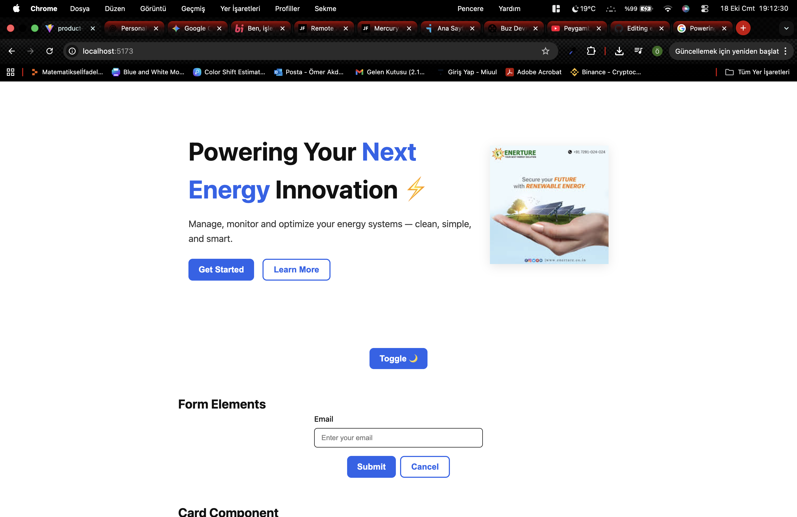
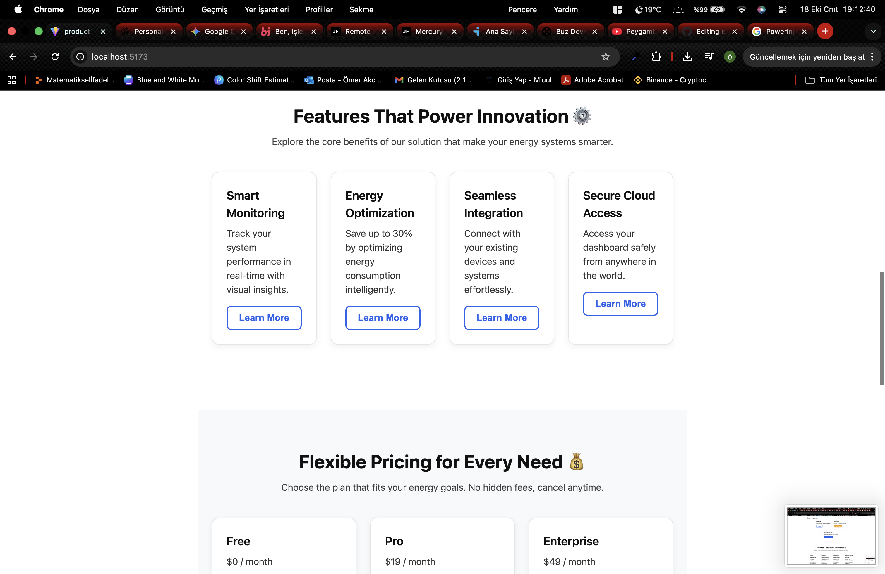
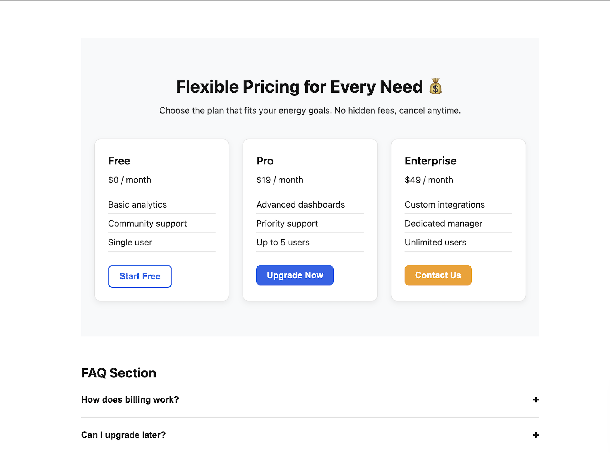
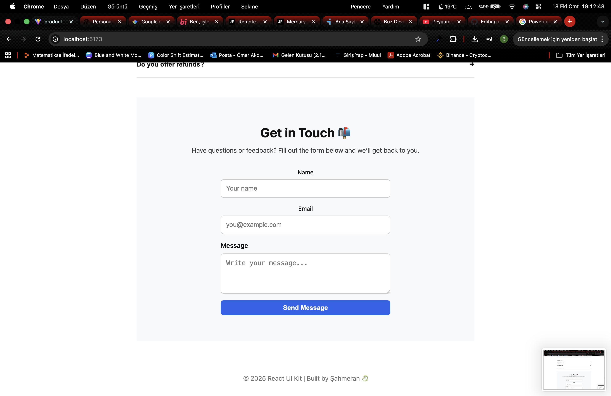
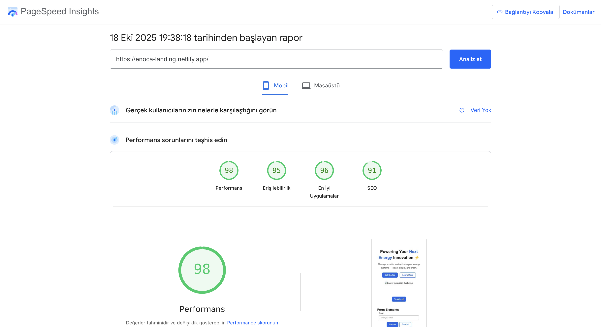

# 🧭 ENOCA Frontend Challenge

## 🧱 Proje Özeti
Bu proje, **React + TypeScript + Vite** kullanılarak geliştirilmiş **tek sayfalık (SPA)** bir ürün tanıtım (landing) uygulamasıdır.  
Amaç, sade ama ölçeklenebilir bir **UI Kit + Landing Page** mimarisi oluşturmaktır.  

Uygulama; **Hero, Features, Pricing, FAQ ve Contact** bölümlerini içeren,  
aynı zamanda **Button, Input, Card, Modal ve Accordion** bileşenlerinden oluşan küçük bir UI kütüphanesini içerir.

---

## 🌐 Canlı Demo
> 📍 enoca-landing.netlify.app

---

## 🧩 Uygulama Yapısı

product-landing/
├── public/
├── src/
│ ├── components/
│ │ ├── sections/
│ │ │ ├── Hero/
│ │ │ ├── Features/
│ │ │ ├── Pricing/
│ │ │ ├── FAQ/
│ │ │ └── Contact/
│ │ └── ui/
│ │ ├── Button/
│ │ ├── Card/
│ │ ├── Modal/
│ │ ├── Accordion/
│ │ └── Input/
│ ├── styles/
│ │ ├── _variables.scss
│ │ └── global.scss
│ ├── App.tsx
│ └── main.tsx
├── tsconfig.json
├── package.json
└── vite.config.ts

## ⚙️ Teknolojiler

| Kategori | Teknoloji |
|-----------|------------|
| Framework | React 18 + TypeScript |
| Bundler | Vite |
| Styling | SCSS Modules |
| Linter | ESLint + Prettier |
| Mimari | Feature-based UI Architecture |
| Versiyon Kontrol | Git + GitHub |

---

## 💡 Özellikler
- 🌗 **Light/Dark Tema Desteği**
- 📱 **Mobil Öncelikli (Responsive)** tasarım
- 🧩 **Custom UI Bileşenleri** (Button, Input, Card, Modal, Accordion)
- 🧾 **Form Doğrulama** (boş alan + e-posta format kontrolü)
- ♿ **Erişilebilirlik** (label-for ilişkisi, kontrast desteği)
- ⚡ **Performans Odaklı** (Vite + HMR + lazy-load)
- 🎨 **SCSS Değişkenleri ve Tema Renkleri**
- 🧱 **Feature-Based Component Structure**

feat: yeni özellik eklendi
fix: hata düzeltildi
docs: dökümantasyon güncellendi
style: görsel düzenleme yapıldı
Lint & Format: ESLint + Prettier aktif

Tip Güvenliği: Tüm bileşenler TypeScript ile yazılmıştır

CSS: SCSS Modules ile izole stiller

## 📸 Ekran Görselleri

Aşağıda proje arayüzünün temel bölümleri yer almaktadır.  
Tüm ekran görüntüleri `public/images/` klasöründe saklanmıştır.

| 🏠 Hero | ⚙️ Features | 💰 Pricing | 📬 Contact |PageSpeed Insights |
|:--:|:--:|:--:|:--:|:--:| 
|  |  |  |  |  |

> Görseller demo sırasında alınmıştır.  
> Her biri Light/Dark tema desteğini ve responsive tasarımı göstermektedir.

			

🧠 Karar Kayıtları (ADR)
ADR-01: React + Vite + TypeScript tercih edildi — yüksek hız ve modern geliştirme ortamı için.

ADR-02: SCSS Modules, component başına izole edilmiş stiller sağlar.

ADR-03: Harici UI kütüphaneleri kullanılmadı — tamamen custom komponent yapısı.

🧪 Lighthouse Hedefleri
Metri̇k	Hedef Skor
Performance	≥ 90
Accessibility	≥ 90
Best Practices	≥ 90
SEO	≥ 90

🧠 Sürüm ve Dökümantasyon
Lint: npm run lint

Build: npm run build

Preview: npm run preview